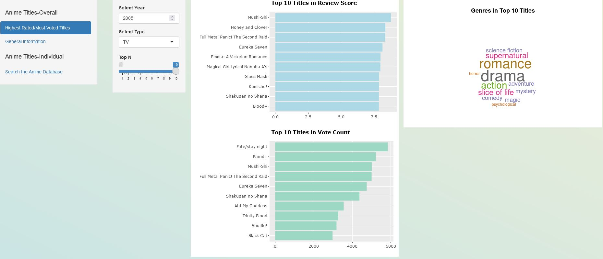
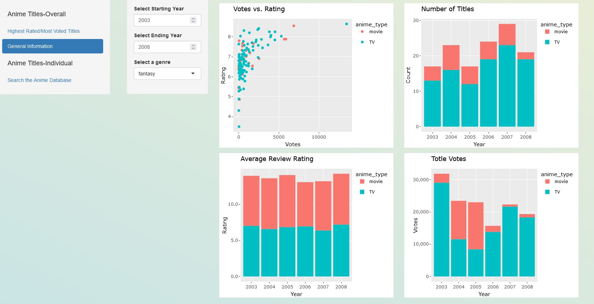
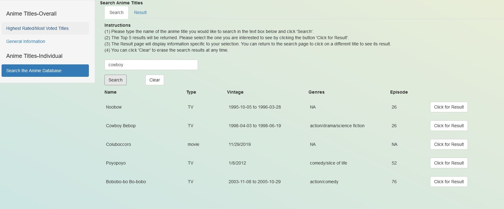
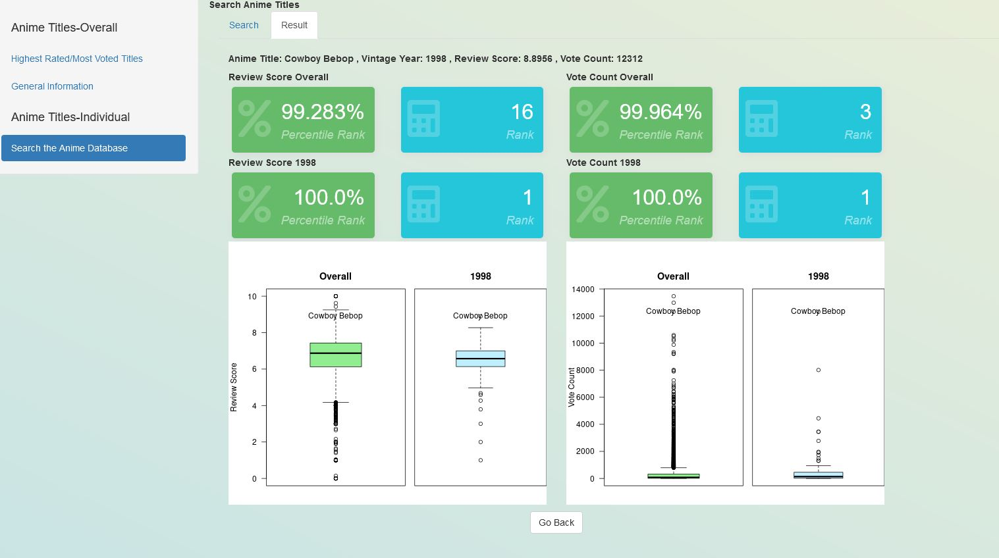

# Anime Shiny Dashboard

**Summary**
---
In this project I attempt to create an interactive dashboard using the R shiny framework.  I collect the data from the Anime News Network official API.  The dashboard will allow the user to (1) see top 1 – top 10 anime titles by year and type, genres represented by these anime titles, (2) examine the trend in key metrics such as number of votes, review ratings by selecting start/end year and a particular genre, (3) look for a particular anime title using name search in a mini search engine. The search feature will let the user pick any title given the Top 5 search results and examine how the selected title compares to all other titles in the same vintage year or all years combined. The key metrics compared are displayed in terms of absolute ranking and percentile ranking.

**Dashboard Deployed to Heroku**
---
Please check out the dashboard at https://anime-shiny-dashboard.herokuapp.com/

* Here are some screenshots

**Step 1: Data Preparation and Cleaning**
---
Anime News Network (www.animenewsnetwork.com) is one of the most trusted anime news sources online. The office API at https://www.animenewsnetwork.com/encyclopedia/api.php is the source of data for this project.
*	[data_preparation.R](https://github.com/RonaldLi-GitHub/Anime_Shiny_Dashboard/blob/main/data_preparation.R) contains the code for this section
*	A call to the reports API generates the anime ID numbers for all anime titles in the database. In this project, I focus on the type of TV and movie. All anime titles of types TV and movie are retrieved from the first API call
*	Once the list of anime IDs are collected, calls can be made to the encyclopedia API to generate detailed information about each anime title
*	Each API call collects information on 50 anime titles
*	Complete data is stored in a data frame
*	Most fields are in clean state. Missing values are coded as NA
*	Vintage is the time period for when the show first aired and when it ended. The information from API on this field requires cleaning because some titles have vintage displayed in month/date/year, while others only show only month or only year. For consistency across all titles, only year is retained and coded as vintage year
*	The field on Genres also requires cleaning because many of the anime titles do not fall in a single genre. Often, the anime titles fall in 5 or 6 different genres. In this project, all genres for each titles are collapsed into a single column

**Step 2: Building the Dashboard**
---
[ui.R](https://github.com/RonaldLi-GitHub/Anime_Shiny_Dashboard/blob/main/ui.R) and [server.R](https://github.com/RonaldLi-GitHub/Anime_Shiny_Dashboard/blob/main/server.R) contain the code for this section. [ui.R](https://github.com/RonaldLi-GitHub/Anime_Shiny_Dashboard/blob/main/ui.R) refers to the user interface. [server.R](https://github.com/RonaldLi-GitHub/Anime_Shiny_Dashboard/blob/main/server.R) refers to logic behind the visualization and user interactions.

*Tab 1: Top N Anime Titles*
*	Drop-down list for Vintage Year and Type and a slider for Top 1 to Top 10 are placed 
*	Horizontal bar charts are displayed in descending order of the key metrics 
*	Word cloud is placed next to the bar charts to display the most common genres found in the Top N anime titles

*Tab 2: General Information*
*	Start year and end year filters are placed with validation to ensure end year is not before start year
*	Drop-down list is placed for Genres. Due to the nature of each anime title having multiple genres, the emphasis is placed on genre rather on the titles themselves. For example, if “Action” is selected, all anime titles that have an “Action” component are selected. If “Comedy” is selected, all anime titles that have a “Comedy” component are selected. Because there are overlaps between the selections, the emphasis naturally shifts away from the anime titles to the genres as a whole
*	Vertical bar charts and scatter plots are main visualization tools in this tab

*Tab 3: Search the Anime Database*
*	This serves as a mini search engine. The focus is on individual titles
*	The user enters text in the search bar. The dashboard returns the top 5 results. The logic behind the search is stringdistmatrix, which computes the distance between strings
*	Once the top 5 research results appear, an action button also appears along with each result. The user can select any of the 5 entries. The action button takes the user to the results mini tab and display the following information specific to the selection
  *	Anime title, vintage year
  *	Absolute ranking in votes, ratings for selected vintage year or all years
  *	Percentile ranking in votes, ratings for selected vintage year or all years
  *	Boxplots for votes, ratings with the selected title embedded in the charts
*	The user can go back to the search results to select another title or clear all results

